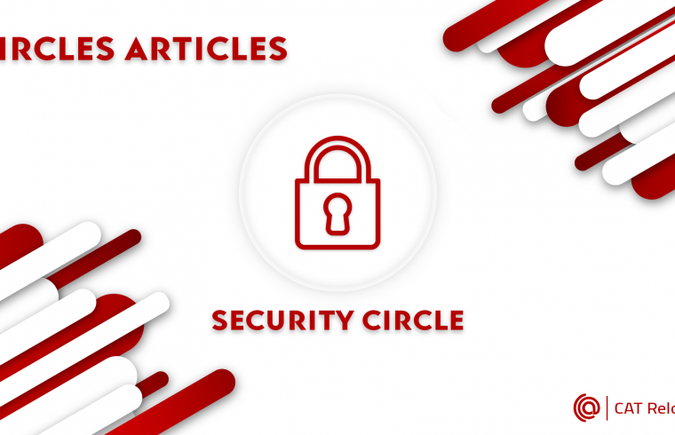
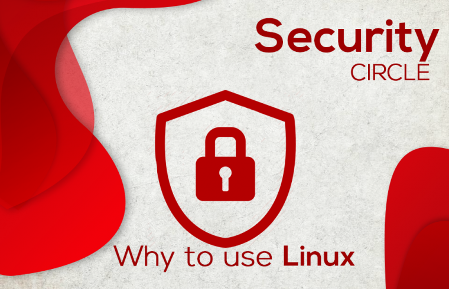
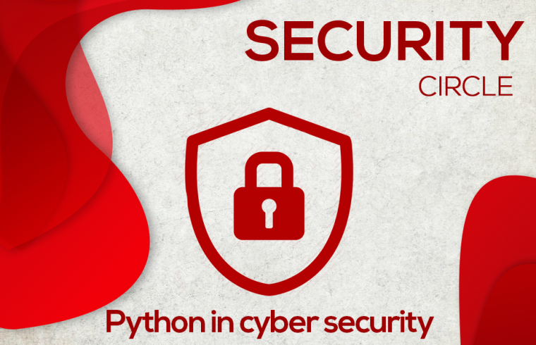

# CAT-Reloaded-Cyber-Security-Cirlcle-Road-Map

| 📚 Content                                                  | 🔎 Roadmaps                                              | 
|-------------------------------------------------------------|-----------------------------------------------------------| 
| [CAT Reloaded Cyber Security PATH](https://github.com/YasserElsnbary/CAT-Reloaded-Cyber-Security-Cirlcle-Road-Map#cat-reloaded-cyber-security-path)|[Reverse Engineering & Malware Analysis Path (REMAR)](https://github.com/YasserElsnbary/CAT-Reloaded-Cyber-Security-Cirlcle-Road-Map#1%EF%B8%8F%E2%83%A3-reverse-engineering--malware-analysis-path-remar)| 
| [CAT Reloaded](https://github.com/YasserElsnbary/CAT-Reloaded-Cyber-Security-Cirlcle-Road-Map#cat-reloaded)|[Penetration Testing Path](https://github.com/YasserElsnbary/CAT-Reloaded-Cyber-Security-Cirlcle-Road-Map#2%EF%B8%8F%E2%83%A3-penetration-testing-path)|
| [before start you should know](https://github.com/YasserElsnbary/CAT-Reloaded-Cyber-Security-Cirlcle-Road-Map#before-start-you-should-know)| [Network Security Path (defensive)](https://github.com/YasserElsnbary/CAT-Reloaded-Cyber-Security-Cirlcle-Road-Map#3%EF%B8%8F%E2%83%A3-network-security-path-defensive)                 | 
| [ENTRY LEVEL](https://github.com/YasserElsnbary/CAT-Reloaded-Cyber-Security-Cirlcle-Road-Map#entry-level)|                      		 
|[Kickoff](https://github.com/YasserElsnbary/CAT-Reloaded-Cyber-Security-Cirlcle-Road-Map#kickoff)|              						 
|[Technical Mentors](https://github.com/YasserElsnbary/CAT-Reloaded-Cyber-Security-Cirlcle-Road-Map#technical-mentors)|                       					               
## [CAT Reloaded Cyber Security PATH](https://docs.google.com/document/d/1LIJWZ2EpaT6O0yvQhLKKj-bmRkROYfRsJClZuNqkThk/edit?usp=sharing "CAT Reloaded Cyber Security PATH") 

   In the beginning; I must mention [Nidal Fikri](https://www.linkedin.com/in/nidal-fikri-776403125/ "Nidal Fikri") who brought the Circle back to work and we learned a lot from him.
This year, I'm the Leader of the Circle going to put our Mentors vision on this road map
you can chat with me any time, feel free to talk with me [Yasser Elsnbary](https://www.linkedin.com/in/yasser-elsnbary-475383159/ "Yasser Elsnbary")

------------

## [CAT Reloaded](https://www.facebook.com/CATReloaded "CAT Reloaded")

------------

▶ What is [CAT Reloaded](https://www.facebook.com/CATReloaded "CAT Reloaded")?

📌 [CAT Reloaded](https://www.facebook.com/CATReloaded "CAT Reloaded") Abbreviation for **C**omputer **A**ssistance **T**eam was from **1996** and reloaded again so it gained its name **CAT Reloaded** from this matter.

------------

▶ What do we do in [CAT Reloaded](https://www.facebook.com/CATReloaded "CAT Reloaded")?

📌 The team is interested in forming technical circles in order to form communities that help and participate in learning modern software technology such as: **Cyber Security**, **Gaming**, **Web Development**, **Mobile Development**, **Data Science**, **Embedded system** and **Graphic Design**.

------------

▶ How can you follow us on social media or offline?

📌 [CAT Reloaded](https://www.facebook.com/CATReloaded "CAT Reloaded") community in Mansoura, you know more about us and our activities through our social media:

💻[Web site](http://catreloaded.org/ "Web site")

💻[GitHub](https://github.com/CATReloaded "Web site")

📱 [Facebook Page](https://www.facebook.com/pg/CATReloaded "Facebook Page")

📱 [Facebook Group](https://www.facebook.com/groups/catreloaded.team "Facebook Group")

📱 [Twitter](https://twitter.com/CATReloaded "Twitter")

📱 [Linkedin](https://www.linkedin.com/company/cat-reloaded/ "Linkedin")

👓[YouTube](https://www.youtube.com/user/C4TReloaded "YouTube")

------------

▶ How to be a member of CAT Reloaded?

📌 Almost every year we host a recruitment [Event](https://www.facebook.com/events/375956410319681/?active_tab=discussion "Event") in Mansoura University to attract all of the interested students in Computer Science in general, categorizing them in Circles meant for different fields, of course there is a Cyber Security Circle.

------------

## before start you should know:

▶  So what is“Cyber Security”?

📌 It is the protection of computer systems from theft or damage to their hardware, software or electronic data, as well as from disruption or misdirection of the services they provide
 enriched your mind with these talks from [TEDx](https://www.ted.com/playlists/10/who_are_the_hackers "TEDx") about cybersecurity and hackers.

------------

▶ What do we need to start?

📌 To start you should build your land hard so we have some basics you should      know at first to be ready to start your study in cybersecurity. These basics will be in our entry level.

> You do not need any requirements to start, you only need **Passion**, **Power** and **Persistence**

------------

▶ What is a good resource to study ?

📌 You should know that the Cyber Security path is not easy or clear and it takes time, there is no clear path to you or path from 0 to hero.

📌 We make an effort to make our paths in this field or in our life to make it easier from other mentors, good resources, study smart and be in touch with new technologies. This is a way to learn, this field is different from other fields.

📌 you should study everytime if you are beginner or expert you will not reach the top because this track is increasing rapidly you can't imagine that it has a lot of branches like Pentesting, Reverse Engineering, Digital Forensics and a lot of them and a lot of jobs in this career to ensure of that please watch this [video](https://youtu.be/2TofunAI6fU "video").

------------

▶ What are our branches in Circle?
1. [Penetration testing](https://drive.google.com/drive/folders/1U_Y9-pp7f2pTT3NSWVnhFkztpVmEROuj?usp=sharing "Penetration testing")✅
	- [Web Pentesting](https://drive.google.com/file/d/1YlYBgkith2ycK8aqP2bv_a-S9YD6LANi/view?usp=sharing "Web Pentesting")✅
	- [Network Pentesting](https://drive.google.com/file/d/1OGCm2PHs0qX1NqmkeZFv9q-lo10fPbht/view?usp=sharing "Network Pentesting") ✅
	- [Mobile Pentesting](https://drive.google.com/drive/folders/1UUk4SZIh_2iLQgzyrOlLkFFbWCrZOJ0t?usp=sharing "Mobile Pentesting") ⌛
2. [Reverse Engineering & Malware Analysis](https://drive.google.com/file/d/1VmkBK89A4DXLkZq2FA-eVdoJx2C1KMeC/view?usp=sharing "Reverse Engineering & Malware Analysis")✅
3. [Network Security](https://docs.google.com/document/d/1y1StwJFtd5gtT5LR8cr2n4SysiNABdDNMngVVFmAgjM/edit?usp=sharing "Network Security")✅

------------

# ENTRY LEVEL

▶ Entry level will **not** make you professionals or have a high level in this topic.
	Firstly you need to know if your **passion** is true or false, right or wrong for cyber security to measure your **loving** and **capability** in this field

You should take an overview in:

📌 1. Operating System **(LINUX)**

[why to use Linux ?](https://blog.catreloaded.org/2020/09/why-to-use-linux/)

📌 2. Programming language **(PYTHON)**

[why to Learn Python ?](https://blog.catreloaded.org/2020/07/python-for-cyber-security/)

📌 3. **Networking**

▶ After that you should know what you will study **Pentesting** or **Reverse** or **Networking** 

▶ **Notes:**

🔴 1. At the end of this level, a member can decide if he joined the right circle for him or not.

🔴 2. Please note that the links and courses below are my recommended but may not be the best for everyone, so if you struggle during one of these, you should seek something 		else.

🔴 3. Every 2 weeks there’s a seminar with the leader of the branch to discuss what’s next and what has been achieved so far.

#### ▶ [Plan Time-Line](https://docs.google.com/document/d/1tkTilM82PxNjtr7IDOhXhEBIVVQD5KGvTk_J55lYeyI/edit?usp=sharing "Plan Time-Line")

------------

# kickoff

📌 1. **Before we begin in this level you should know something called:**
	
**-  “Learning  difficulties”:**

🔴 How you study books and references, you must know that many difficulties will confront you with everything you learn, so you should not be bored or unable to do what you must do.

🔴 You must know that you will stop a lot and you will not understand too much, but you must return and resist

**🔴 You must write and practice for everything you learn so that you do not get lost from you, either in your hand or in a text file on your personal computer. Massive practice .**

📌 2. This stage is for those **who will pass the Entry Level.**

📌 3. Before you start, you must Choose your **path** from the 3 **branches**.

📌 4. Please note that the **links** and **courses** below are recommended but may not be  the **best** for everyone, so if you **struggle** during one of these, you should seek something else.

📌 5. This is the **longest** and most **important** level in the circle’s technical road map. It may take more than a year but it is really worth it. A circle member with this knowledge will be fully ready to have **internships** and begin the professional advanced study phase.

📌 6. It’s **recommended** to study the materials in the **order** mentioned below.

------------

## 1️⃣ [Reverse Engineering & Malware Analysis Path (REMAR)](https://drive.google.com/file/d/1VmkBK89A4DXLkZq2FA-eVdoJx2C1KMeC/view?usp=sharing "Reverse Engineering & Malware Analysis Path (REMAR)")

📌 1. Our New Roadmap [HERE](https://drive.google.com/file/d/1VmkBK89A4DXLkZq2FA-eVdoJx2C1KMeC/view?usp=sharing "HERE") includes many steps from **Zero** to **Hero**
**BTW** you will need to practice more.

📌 2.  check out this really nice roadmap made by a fellow CATian!

- **Plan Time-Line** Soon

optional to make it easy to study

------------

## 2️⃣[ Penetration Testing Path](https://drive.google.com/drive/folders/1U_Y9-pp7f2pTT3NSWVnhFkztpVmEROuj?usp=sharing " Penetration Testing Path")

### [Web App Penetration testing Path (WAPTR)](https://drive.google.com/file/d/1YlYBgkith2ycK8aqP2bv_a-S9YD6LANi/view?usp=sharing "Web App Penetration testing Path (WAPTR)")

📌 1. Our New Roadmap [HERE](https://drive.google.com/file/d/1YlYBgkith2ycK8aqP2bv_a-S9YD6LANi/view?usp=sharing "HERE") includes many steps from **Zero** to **Hero**
**BTW** you will need to practice more.

📌 2. **To Practice:**
	- Create account on **[hackerone](https://www.hackerone.com/ "hackerone")** , **[bugcrowd](https://www.bugcrowd.com/ "bugcrowd")**, **[intigriti](https://www.intigriti.com/programs "intigriti")**
	- You should practice very well so you should Download [OWASP Broken Web Application project](https://sourceforge.net/projects/owaspbwa/ "OWASP Broken Web Application project") Try to install it on VMware or VirtualBox from [Here](https://www.youtube.com/watch?v=p7uqu4o3RhY&t=507s "Here")
	- preferable to download this first and practice very well i love:

  1️⃣[bwapp](http://www.itsecgames.com/ "bwapp")

  2️⃣[Dvwa](https://tryhackme.com/room/dvwa "Dvwa")

  3️⃣[portswigger labs](https://portswigger.net/web-security "portswigger labs")

  4️⃣ [Hack The Box](https://www.hackthebox.eu/ "Hack The Box")

  5️⃣[OWASP Juicy](https://tryhackme.com/room/owaspjuiceshop "OWASP Juicy")

  6️⃣[TryHackMe](https://tryhackme.com/ "TryHackMe")
	  
- If you are stuck in a lab solution, try searching on [Google](http://google.com/ "Google")

- **Plan Time-Line** Soon

optional to make it easy to study

------------

### [ Network Penetration testing Path (NPTR)](https://drive.google.com/file/d/1OGCm2PHs0qX1NqmkeZFv9q-lo10fPbht/view?usp=sharing "Network Penetration testing Path (NPTR)")

📌 1. Our New Roadmap **[HERE](https://drive.google.com/file/d/1OGCm2PHs0qX1NqmkeZFv9q-lo10fPbht/view?usp=sharing "HERE")** includes many steps from **Zero** to **Hero** 
**BTW** you will need to practice more.

📌 2. There are many option Courses each course include content may conflict with other courses but there are courses to be unique.

📌 3. We will Practice on Machines **[HTB](https://www.hackthebox.eu/ "HTB")** , **[tryHackMe](https://tryhackme.com/ "tryHackMe")** , **[Vulnhub Walkthrough](https://github.com/Ignitetechnologies/Vulnhub-CTF-Writeups "Vulnhub Walkthrough")**

- **Plan Time-Line** Soon

optional to make it easy to study

------------

### [Mobile App Penetration testing Path (MAPTP)](https://drive.google.com/drive/folders/1UUk4SZIh_2iLQgzyrOlLkFFbWCrZOJ0t?usp=sharing "Mobile App Penetration testing Path (MAPTP)")
📌 Under construction … 

- **Plan Time-Line** Soon

optional to make it easy to study

------------

## **[3️⃣ Network Security Path (defensive)](https://docs.google.com/document/d/1y1StwJFtd5gtT5LR8cr2n4SysiNABdDNMngVVFmAgjM/edit?usp=sharing "Network Security Path (defensive)")**

📌 1. **[CCNA course by Jeremy Cioara](https://www.1377x.to/torrent/112935/CBT-Nuggets-Cisco-CCNA-Certification-Package/ "CCNA course by Jeremy Cioara")** (well first thing is first we need to understand the basic protocols and concepts of network and this course is the main method to achieve this target).

📌 2. **[CCNA-security course by CBt nuggets](https://www.1377x.to/torrent/1380636/CBT-Nuggets-Cisco-CCNA-Security-210-260-IINS/ "CCNA-security course by CBt nuggets")** (this course is the real deal when it comes to network security fundamentals as it  illustrates so many basic technologies and concepts).

📌 3. **[Vmware course](https://www.1377x.to/torrent/3894485/CBT-Nuggets-VMware-NSX-Introduction-and-Installation-FCO/ "Vmware course")** We will walk ourselves together in the virtual machines world through the intermediate level period in the VMware workstation but if you have any intention in taking this as a real challenge you could check this course as well Vmware course.

📌 4. **routeHub - FortiGate 6.0 Firewall Training** (this course dives in the firewall technology as it walks us through the fortigate firewall which is one of the most used products in the industry 
Although it’s a slightly older version but there’s no huge differences in the new version  

**Notes:**

🔴 All of these courses are in English with English subtitles .. if you struggled with it in the beginning please don’t give up. It's highly recommended that you continue gradually because there’s no equivalent quality in Vmware course .. And if it's necessary you can check this **[Arabic](https://www.youtube.com/user/abeerhosni "Arabic")** channel.
We have downloaded all of these courses for you so if you need any of this data offline kindly inform the circle leader before any of the sessions or meetings.

- **Plan Time-Line** Soon

optional to make it easy to study

------------

# Technical Mentors

## 👑 [Muhammed Gamal](https://www.linkedin.com/in/mgyounis/ "Muhammed Gamal")
Technical Mentor for **Penetration Testing**
You Can Learn More From **[Here](https://www.facebook.com/CATReloaded/photos/4184330158308220/ "Here")**

## 👑 [Menna Essa](https://www.linkedin.com/in/menna-sh-essa/ "Menna Essa")
Technical Mentor for **Reverse Engineering & Malware Analysis**
You Can Learn More From **[Here](https://www.facebook.com/CATReloaded/photos/4316533688421199/ "Here")**

## 👑 [Islam Talaat](https://www.linkedin.com/in/islam-talaat/ "Islam Talaat")
Technical Mentor for **Network Security**
You Can Learn More From **[Here](https://www.facebook.com/CATReloaded/photos/4300097826731452/ "Here")**
